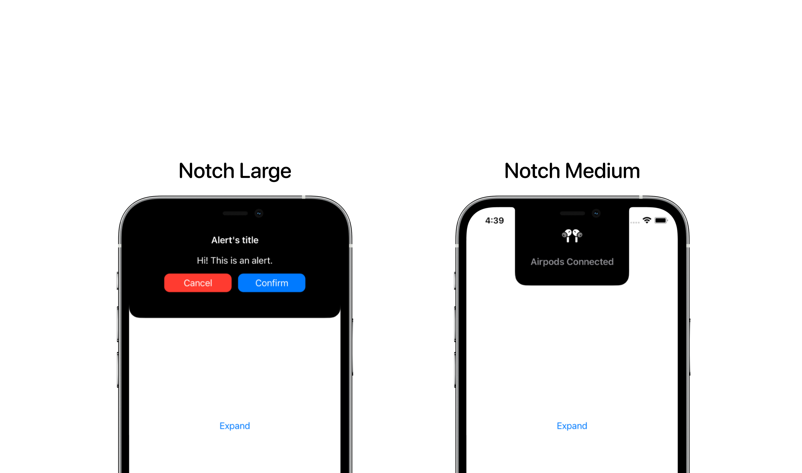

  
  <h1><b>Island Alerts for SwiftUI</b></h1>
  

    IslandAlertsForSwiftUI provides a variety of SwiftUI alerts that integrate perfectly with iPhone’s Dynamic Island and Notch!
     
  

  <a href="https://swift.org">
<!--      -->
    
  </a>
  
  

## Types of alert

### Dynamic Island

- **[IslandLargeAlert](Sources/IslandAlertsForSwiftUI/IslandLargeAlert/README.md)**: a large-size alert expanding from Dynamic Island with cancel and confirmation buttons
- **[IslandMediumAlert](Sources/IslandAlertsForSwiftUI/IslandMediumAlert/README.md)**: a medium-size alert expanding into a top rectangle from the Dynamic Island, useful for small updates
- **[IslandSquareAlert](Sources/IslandAlertsForSwiftUI/IslandSquareAlert/README.md)**: a small-size alert expanding into a square from the Dynamic Island, useful for quick animations

### Notch

Let's not leave our dear old Notch behind!

The package includes the same animations also for the Notch. They may not be as beautiful, but they are useful!

- **[NotchLargeAlert](Sources/IslandAlertsForSwiftUI/NotchLargeAlert/README.md)**: same of IslandLargeAlert but for Notch
- **[NotchMediumAlert](Sources/IslandAlertsForSwiftUI/NotchMediumAlert/README.md)**: same of IslandMediumAlert but for Notch

## Installation

Required:
- iOS 15.0 or above
- Xcode 13.0 or above

In Xcode go to `File -> Add Packages...` and paste in the repo's url: `https://github.com/alessiorubicini/IslandAlertsForSwiftUI`.
f

## License

Copyright 2022 (©) Alessio Rubicini.

The license for this repository is MIT License.

Please see the [LICENSE](LICENSE) file for full reference.
