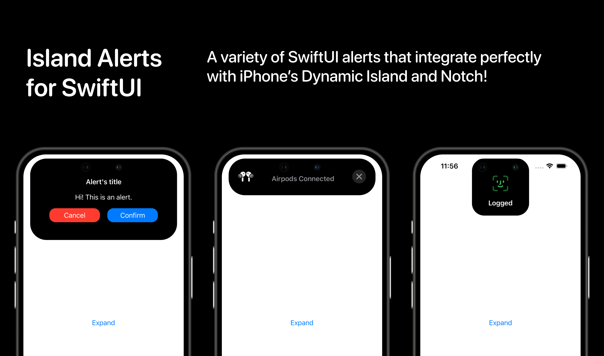

# IslandAlertsForSwiftUI

## Types of alert

### Dynamic Island

- **[IslandLargeAlert](Sources/IslandAlertsForSwiftUI/IslandLargeAlert/README.md)**: a large-size alert expanding from Dynamic Island with cancel and confirmation buttons
- **[IslandMediumAlert](Sources/IslandAlertsForSwiftUI/IslandMediumAlert/README.md)**: a medium-size alert expanding into a top rectangle from the Dynamic Island, useful for small updates
- **[IslandSquareAlert](Sources/IslandAlertsForSwiftUI/IslandSquareAlert/README.md)**: a small-size alert expanding into a square from the Dynamic Island, useful for quick animations

### Notch

Let's not leave our dear old Notch behind!

The package includes the same animations also for the Notch. They may not be as beautiful, but they are useful!

- **[NotchLargeAlert](Sources/IslandAlertsForSwiftUI/NotchLargeAlert)**: same of IslandLargeAlert but for Notch
- **[NotchMediumAlert](Sources/IslandAlertsForSwiftUI/NotchMediumAlert)**: same of IslandMediumAlert but for Notch

