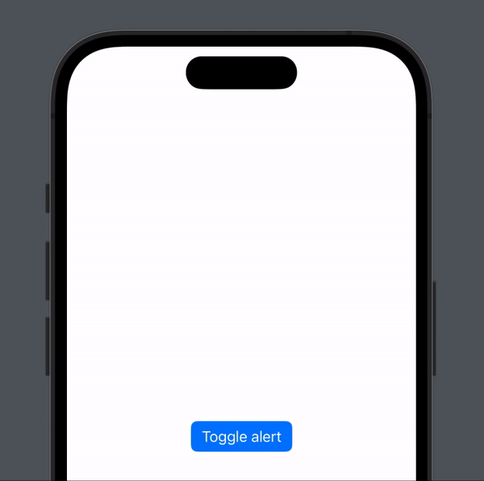

#  Island Large Alert

> A large alert expanding from Dynamic Island with cancel and confirmation buttons

## Parameters

- **isPresented**: A binding to a Boolean value that determines whether to present the alert. When the user presses or taps one of the Cancel action, the system sets this value to false and dismisses.
- **title**: A text string used as the title of the alert.
- **message**: A text string used as the message of the alert, maximum 3 lines of text after which it is truncated
- **action**: function performed when the Confirm button is pressed

## Code

```swift
struct Example: View {
    
    @State private var showAlert = false
    
    public var body: some View {
        Button("Toggle alert") {
            withAnimation {
                    showAlert.toggle()
            }
        }
        
        .islandLargeAlert(isPresented: $showAlert, title: "Hello, Island,", message: "This is a test for presenting an alert from the Dynamic Island.", action: {
                ...
        })
    }
}

```

## Result


