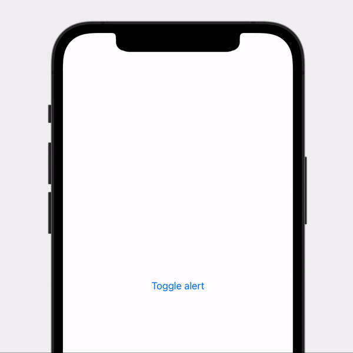

#  Notch Large Alert

> A large-size alert expanding from the top notch with cancel and confirmation buttons

Compatible both with larger notch (iPhone 12 or older) and reduced notch (iPhone 13 or older).

## Parameters

- **isPresented**: A binding to a Boolean value that determines whether to present the alert. When the user presses or taps one of the Cancel action, the system sets this value to false and dismisses.
- **title**: A text string used as the title of the alert.
- **message**: A text string used as the message of the alert, maximum 3 lines of text after which it is truncated
- **action**: function performed when the Confirm button is pressed

## Code

```swift
struct Example: View {
    
    @State private var showAlert = false
    
    public var body: some View {
        Button("Toggle alert") {
            withAnimation {
                showAlert.toggle()
            }
        }
        
        .notchLargeAlert(isPresented: $alert, title: "Hello, Island", message: "This is a test for the new Notch alert.", action: {
            alert.toggle()
        })
    }
}

```

## Result


