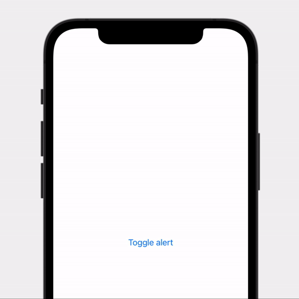

#  Notch Medium Alert

> A medium-size alert expanding into a top rectangle from the notch.

Compatible both with larger notch (iPhone 12 or older) and reduced notch (iPhone 13 or older).

**How can I dismiss it through UI?** By tapping on it.

## Parameters

- **isPresented**: A binding to a Boolean value that determines whether to present the alert. When the user presses or taps one of the Cancel action, the system sets this value to false and dismisses.
- **systemIcon**: The name of the system symbol image. Use the SF Symbols app to look up the names of system symbol images.
- **text**: A text string used as the text of the alert.

## Code

```swift
struct Example: View {
    
    @State private var showAlert = false
    
    public var body: some View {
        Button("Toggle alert") {
            withAnimation {
                showAlert.toggle()
            }
        }
        
        .notchMediumAlert(isPresented: $alert, systemIcon: "airpodspro", title: "Airpods connected")
        
    }
}

```

## Result


